# Jarkom-Modul-5-D05-2023
Laporan Resmi Praktikum Modul 5 Jaringan Komputer 2023

## Author
| Nama | NRP |Github |
|---------------------------|------------|--------|
|Ihsan Widagdo | 5025211231 | https://github.com/dagdo03 |
|Sandyatama Fransisna Nugraha | 5025211196 | https://github.com/TamaFn |

## Daftar Isi
- [Topologi](#topologi)
  - [Topologi pada GNS3](#topologi-pada-gns3)
  - [Pembagian Subnet](#pembagian-subnet)
- [VLSM](#vlsm)
  - [VLSM Tree](#vlsm-tree)
  - [Pembagian IP](#pembagian-ip)
- [Kendala](#kendala)

## Topologi

### Topologi pada GNS3
Berikut adalah topologi jaringan pada GNS3.  
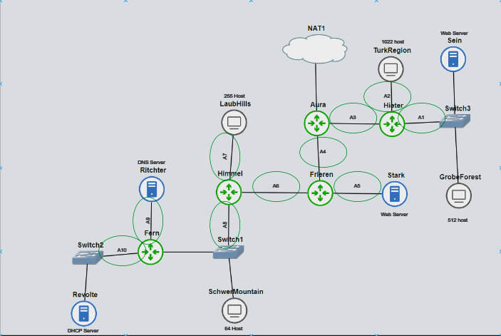

### Pembagian Subnet
Berikut adalah visualisasi pembagian subnet pada topologi jaringan.

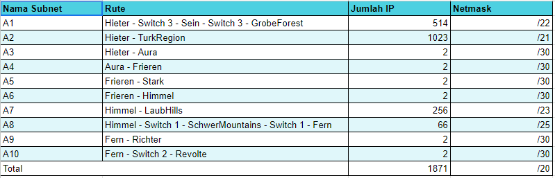

## VLSM
### VLSM Tree

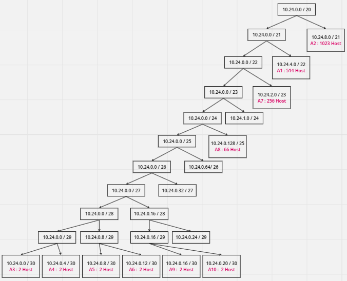

### Pembagian IP

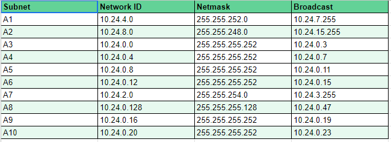

### Konfigurasi dan Routing
Berikut adalah konfigurasi jaringan tiap node pada topologi.
- Aura (Router)
```bash
auto lo
iface lo inet loopback

auto eth0
iface eth0 inet dhcp

auto eth1
iface eth1 inet static
address 10.24.0.1
netmask 255.255.255.252

auto eth2
iface eth2 inet static
address 10.24.0.5
netmask 255.255.255.252


#eth 1
up route add -net 10.24.8.0 netmask 255.255.248.0 gw 10.24.0.2
up route add -net 10.24.4.0 netmask 255.255.252.0 gw 10.24.0.2

#eth2
up route add -net 10.24.0.8 netmask 255.255.255.252 gw 10.24.0.6
up route add -net 10.24.0.12 netmask 255.255.255.252 gw 10.24.0.6
up route add -net 10.24.2.0 netmask 255.255.254.0 gw 10.24.0.6
up route add -net 10.24.0.128 netmask 255.255.255.128 gw 10.24.0.6
up route add -net 10.24.0.16 netmask 255.255.255.252 gw 10.24.0.6
up route add -net 10.24.0.20 netmask 255.255.255.252 gw 10.24.0.6
```

- Freiren (Router)
```bash
auto eth0
iface eth0 inet static
address 10.24.0.6
netmask 255.255.255.252
gateway 10.24.0.5

auto eth1
iface eth1 inet static
address 10.24.0.9
netmask 255.255.255.252

auto eth2
iface eth2 inet static
address 10.24.0.13
netmask 255.255.255.252


#eth2
up route add -net 10.24.2.0 netmask 255.255.254.0 gw 10.24.0.14
up route add -net 10.24.0.128 netmask 255.255.255.128 gw 10.24.0.14
up route add -net 10.24.0.16 netmask 255.255.255.252 gw 10.24.0.14
up route add -net 10.24.0.20 netmask 255.255.255.252 gw 10.24.0.14
```

- Heiter (Router)
```bash
auto lo
iface lo inet loopback

auto eth0
iface eth0 inet static
address 10.24.0.2
netmask 255.255.255.252
gateway 10.24.0.1

auto eth1
iface eth1 inet static
address 10.24.8.1
netmask 255.255.248.0

auto eth2
iface eth2 inet static
address 10.24.4.1
netmask 255.255.252.0
```

- Himmel (Router)
```bash
auto eth0
iface eth0 inet static
address 10.24.0.14
netmask 255.255.255.252
gateway 10.24.0.13

auto eth1
iface eth1 inet static
address 10.24.2.1
netmask 255.255.254.0

auto eth2
iface eth2 inet static
address 10.24.0.129
netmask 255.255.255.128

#eth2
up route add -net 10.24.0.16 netmask 255.255.255.252 gw 10.24.0.131
up route add -net 10.24.0.20 netmask 255.255.255.252 gw 10.24.0.131
```

- Fern (Router)
```bash
auto eth0
iface eth0 inet static
address 10.24.0.131
netmask 255.255.255.128
gateway 10.24.0.129

auto eth1
iface eth1 inet static
address 10.24.0.17
netmask 255.255.255.252

auto eth2
iface eth2 inet static
address 10.24.0.21
netmask 255.255.255.252
```

- Sein (Web Server)
```bash
auto eth0
iface eth0 inet static
address 10.24.4.2
netmask 255.255.252.0
gateway 10.24.4.1

up echo 192.168.122.1 > /etc/resolv.conf
```

- Stark (Web Server)
```bash
auto eth0
iface eth0 inet static
address 10.24.0.10
netmask 255.255.255.252
gateway 10.24.0.9

up nameserver 192.168.122.1 > /etc/resolv.conf
```

- Richter (DNS Server)
```bash
auto eth0
iface eth0 inet static
address 10.24.0.18
netmask 255.255.255.252
gateway 10.24.0.17
```

- Revolte (DHCP Server)
```bash
auto eth0
iface eth0 inet static
address 10.24.0.22
netmask 255.255.255.252
gateway 10.24.0.21

up nameserver 192.168.122.1 > /etc/resolv.conf
```

- TurkRegion (Client : 1022 Host) 
```bash
auto eth0
iface eth0 inet dhcp
#address 10.24.8.2
#netmask 255.255.248.0
gateway 10.24.8.1

up nameserver 192.168.122.1 > /etc/resolv.conf
```

- GrobeForest (Client : 512 Host)
```bash
auto eth0
iface eth0 inet dhcp
#address 10.24.4.3
#netmask 255.255.252.0
gateway 10.24.4.1

up echo 192.168.122.1 > /etc/resolv.conf
```

- LaubHills (Client : 255 Host) 
```bash
auto eth0
iface eth0 inet dhcp
#address 10.24.2.2
#netmask 255.255.254.0
gateway 10.24.2.1
```

- SchwerMountain (Client : 64 Host) 
```bash
auto eth0
iface eth0 inet dhcp
#address 10.24.0.130
#netmask 255.255.255.248
gateway 10.24.0.129
```

### Berikut adalah konfigurasi routing pada tiap node.
- Aura (Router)
```bash
apt-get update
ETH0_IP=$(ip -4 addr show eth0 | grep -oP '(?<=inet\s)\d+(\.\d+){3}')
iptables -t nat -A POSTROUTING -o eth0 -j SNAT --to $ETH0_IP
apt-get install isc-dhcp-relay -y
apt-get install netcat -y
echo 'SERVERS="10.24.0.22"  
INTERFACES="eth0 eth1 eth2"
OPTIONS=""
' > /etc/default/isc-dhcp-relay
echo ' 
net.ipv4.ip_forward=1
' > /etc/sysctl.conf
service isc-dhcp-relay start
iptables -A PREROUTING -t nat -p tcp --dport 80 -d 10.24.4.2 -m statistic --mod$

iptables -A PREROUTING -t nat -p tcp --dport 80 -d 10.24.4.2 -j DNAT --to-desti$

iptables -A PREROUTING -t nat -p tcp --dport 443 -d 10.24.0.10 -m statistic --m$

iptables -A PREROUTING -t nat -p tcp --dport 443 -d 10.24.0.10 -j DNAT --to-des$
```

- Frieren (Router)
```bash
echo 'nameserver 192.168.122.1' > /etc/resolv.conf
apt-get update
apt-get install isc-dhcp-relay -y
echo 'SERVERS="10.24.0.22"  
INTERFACES="eth0 eth1 eth2"
OPTIONS=""
' > /etc/default/isc-dhcp-relay
echo '
net.ipv4.ip_forward=1
' > /etc/sysctl.conf
service isc-dhcp-relay start

iptables -A PREROUTING -t nat -p tcp --dport 80 -d 10.24.4.2 -m statistic --mod$

iptables -A PREROUTING -t nat -p tcp --dport 80 -d 10.24.4.2 -j DNAT --to-desti$

iptables -A PREROUTING -t nat -p tcp --dport 443 -d 10.24.0.10 -m statistic --m$

iptables -A PREROUTING -t nat -p tcp --dport 443 -d 10.24.0.10 -j DNAT --to-des$
```


- Heiter (Router)
```bash
echo 'nameserver 192.168.122.1' > /etc/resolv.conf
apt-get update
apt-get install isc-dhcp-relay -y
echo 'SERVERS="10.24.0.22"  
INTERFACES="eth0 eth1 eth2"
OPTIONS=""
' > /etc/default/isc-dhcp-relay
echo '
net.ipv4.ip_forward=1
' > /etc/sysctl.conf
service isc-dhcp-relay start
iptables -A PREROUTING -t nat -p tcp --dport 80 -d 10.24.4.2 -m statistic --mod$

iptables -A PREROUTING -t nat -p tcp --dport 80 -d 10.24.4.2 -j DNAT --to-desti$

iptables -A PREROUTING -t nat -p tcp --dport 443 -d 10.24.0.10 -m statistic --m$

iptables -A PREROUTING -t nat -p tcp --dport 443 -d 10.24.0.10 -j DNAT --to-des$
```

- Himmel (Router)
```bash
echo 'nameserver 192.168.122.1' > /etc/resolv.conf
apt-get update
apt-get install isc-dhcp-relay -y
echo '
SERVERS="10.24.0.22"
INTERFACES="eth0 eth1 eth2"
OPTIONS=""
' > /etc/default/isc-dhcp-relay
echo '
net.ipv4.ip_forward=1
' > /etc/sysctl.conf
service isc-dhcp-relay start
```

- Fern (Router)
```bash
echo 'nameserver 192.168.122.1' > /etc/resolv.conf
apt-get update
apt-get install isc-dhcp-relay  -y
echo '
SERVERS="10.24.0.22"
INTERFACES="eth0 eth1 eth2"
OPTIONS="" 
' > /etc/default/isc-dhcp-relay
echo '
net.ipv4.ip_forward=1
' > /etc/sysctl.conf
service isc-dhcp-relay start
```

- Revolte (DHCP Server)
```bash
echo 'nameserver 192.168.122.1' > /etc/resolv.conf
apt-get update
apt-get install isc-dhcp-server -y
echo '# Defaults for isc-dhcp-server initscript
INTERFACES="eth0" 
' > /etc/default/isc-dhcp-server
echo '"subnet 10.24.2.0 netmask 255.255.254.0 {
    range 10.24.2.2 10.24.3.254;
    option routers 10.24.2.1;
    option broadcast-address 10.24.3.255;
    #option domain-name-servers 10.24.0.18;
    default-lease-time 600;
    max-lease-time 7200;
}
subnet 10.24.0.128 netmask 255.255.255.128 {
    range 10.24.0.130 10.24.0.254;
    option routers 10.24.0.129;
    option broadcast-address 10.24.0.255;
    #option domain-name-servers 10.24.0.18;
    default-lease-time 600;
    max-lease-time 7200;
}
subnet 10.24.8.0 netmask 255.255.248.0 {
    range 10.24.8.2 10.24.15.254;
    option routers 10.24.8.1;
    option broadcast-address 10.24.15.255;
    #option domain-name-servers 10.24.0.18;
    default-lease-time 600;
    max-lease-time 7200;
}
subnet 10.24.4.0 netmask 255.255.252.0 {
    range 10.24.4.2 10.24.7.254;
    option routers 10.24.4.1;
    option broadcast-address 10.24.7.255;
    #option domain-name-servers 10.24.0.18;
    default-lease-time 600;
    max-lease-time 7200;
}
subnet 10.24.0.20 netmask 255.255.255.252 {
}
subnet 10.24.0.16 netmask 255.255.255.252 {
}
subnet 10.24.0.12 netmask 255.255.255.252 {
}
subnet 10.24.0.8 netmask 255.255.255.252 {
}
subnet 10.24.0.0 netmask 255.255.255.252 {
}
" ' > /etc/dhcp/dhcpd.conf
service isc-dhcp-server restart
iptables -A INPUT -m state --state ESTABLISHED,RELATED -j ACCEPT
iptables -A INPUT -p icmp -m connlimit --connlimit-above 3 --connlimit-mask 0 -$
```

- Richter (DNS Server)
```bash
iptables -A INPUT -m state --state ESTABLISHED,RELATED -j ACCEPT
iptables -A INPUT -p icmp -m connlimit --connlimit-above 3 --connlimit-mask 0 -$
```

- Sein (Web Server)
```bash
#no 8
echo 'nameserver 192.168.122.1' > /etc/resolv.conf
apt-get update
apt-get install netcat -y
#no 4
#iptables -A INPUT -p tcp --dport 22 -s 10.24.4.0/22 -j ACCEPT
#no 5
iptables -A INPUT -p tcp --dport 22 -m time --timestart 12:00 --timestop 13:00 $
iptables -A INPUT -p tcp --dport 22 -m time --timestart 11:00 --timestop 13:00 $
iptables -A INPUT -p tcp --dport 22 -s 10.24.4.0/22 -m time --timestart 08:00 -$
iptables -A INPUT -p tcp --dport 22 -j DROP
start_pemilu=$(date -d "2023-10-19T00:00" +"%Y-%m-%dT%H:%M")
end_pemilu=$(date -d "2024-02-15T00:00" +"%Y-%m-%dT%H:%M")
iptables -A INPUT -p tcp -s 10.24.0.20/30 --dport 80 -m time --datestart "$star$
#no 9
iptables -N scan_port

iptables -A INPUT -m recent --name scan_port --update --seconds 600 --hitcount $

iptables -A FORWARD -m recent --name scan_port --update --seconds 600 --hitcoun$

iptables -A INPUT -m recent --name scan_port --set -j ACCEPT

iptables -A FORWARD -m recent --name scan_port --set -j ACCEPT
iptables -A INPUT  -j LOG --log-level debug --log-prefix 'Dropped Packet' -m li$
```

- SchwerMountain (Client)
```bash

```

- LaubHills (Client)
```bash

```

- TurkRegion (Client)
```bash
echo nameserver 192.168.122.1 > /etc/resolv.conf
apt-get update
apt-get install netcat -y

iptables -A INPUT -p tcp --dport 8080 -j ACCEPT
#iptables -A INPUT -p tcp -j DROP
iptables -A INPUT -p udp -s 10.24.0.0/20 -j DROP
nc -lvp 8080
```

- GrobeForest  (Client)
```bash

```

## Testing

<br>
Sebelum menjalankan soal dibawah ini, running semua routing tanpa terkecuali. Setelah itu, running Revolte (DHCP Server). Bila terdapat error, lakukan 
```bash
rm -r /var/run/dhcpd.pid
service isc-dhcp-server start
``` 

## Soal Praktikum

### 1. Agar topologi yang kalian buat dapat mengakses keluar, kalian diminta untuk mengkonfigurasi Aura menggunakan iptables, tetapi tidak ingin menggunakan MASQUERADE

Lakukan setting Pada Aura dalam `.bashrc` sebagai berikut
```bash
ETH0_IP=$(ip -4 addr show eth0 | grep -oP '(?<=inet\s)\d+(\.\d+){3}')
iptables -t nat -A POSTROUTING -o eth0 -j SNAT --to $ETH0_IP
```

Hasil Program
<br>

Sein
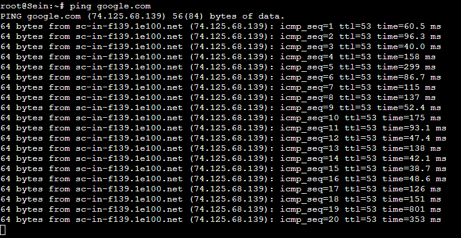

Stark
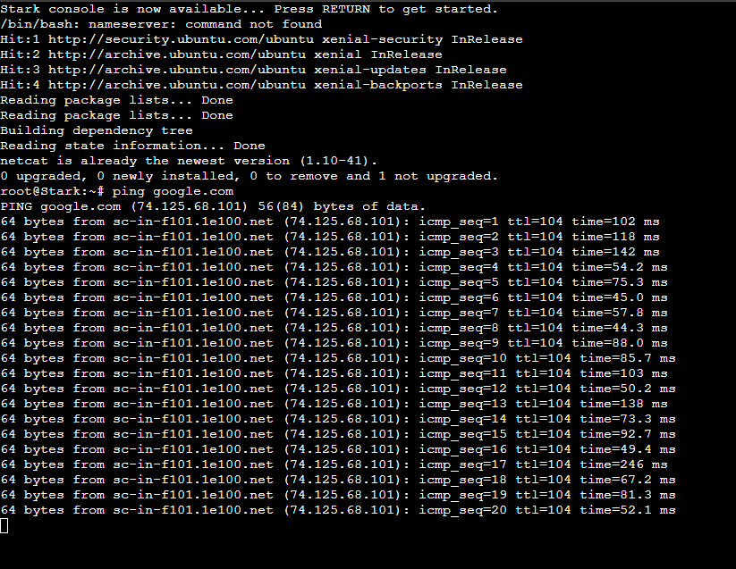

Richter
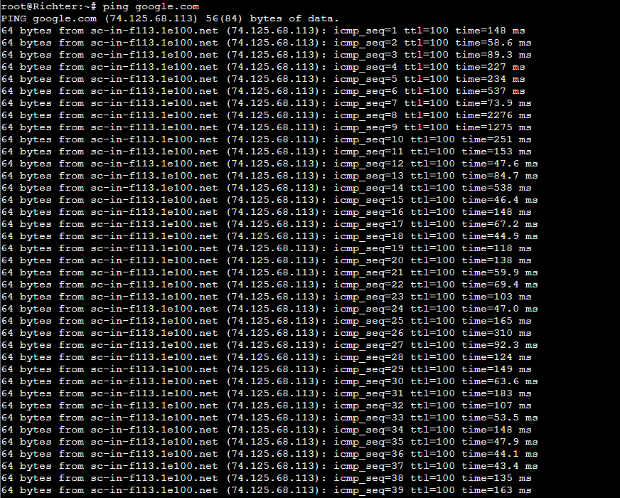

Revolte
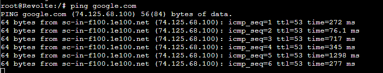

### 2. Kalian diminta untuk melakukan drop semua TCP dan UDP kecuali port 8080 pada TCP.

```bash
ETH0_IP=$(ip -4 addr show eth0 | grep -oP '(?<=inet\s)\d+(\.\d+){3}')
iptables -t nat -A POSTROUTING -o eth0 -j SNAT --to $ETH0_IP
```
Langkah yang dilakukan adalah install terlebih dahulu pada `Grobeforest` dengan command 
```bash
apt-get update
apt-get install netcat -y
# ip TurkRegion yang digunakan saat ini
nc 10.24.8.5 8080 
```
Maka hasil yang diperoleh adalah sebagai berikut

Grobe Forest
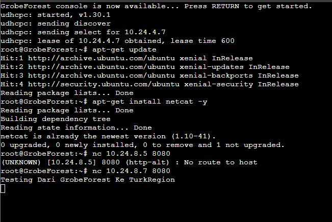
TurkRegion
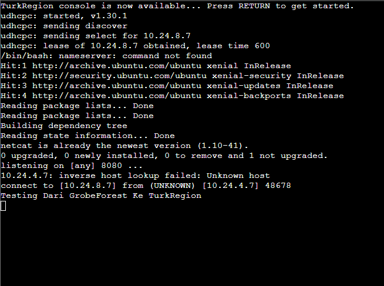

Apabila connection terputus, maka lakukan command pada TurkRegion
```bash
# ip GrobeForrest yang digunakan saat ini
nmap -p 22 20.24.0.10 
```

### 3. Kepala Suku North Area meminta kalian untuk membatasi DHCP dan DNS Server hanya dapat dilakukan ping oleh maksimal 3 device secara bersamaan, selebihnya akan di drop.

Lakukan ping pada Richter (DNS Server) dan Revolte (DHCP Server) dengan menggunakan 4 client sebagai testing. Apabila client 4 tidak bisa mengakses, maka program berjalan dengan baik

#### Ping Richter
LaubHills


SchewerMountains
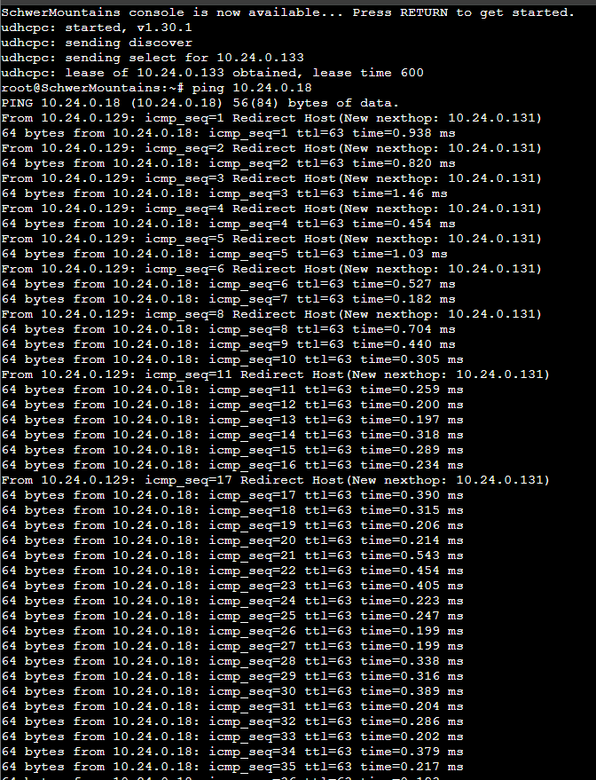

TurkRegion
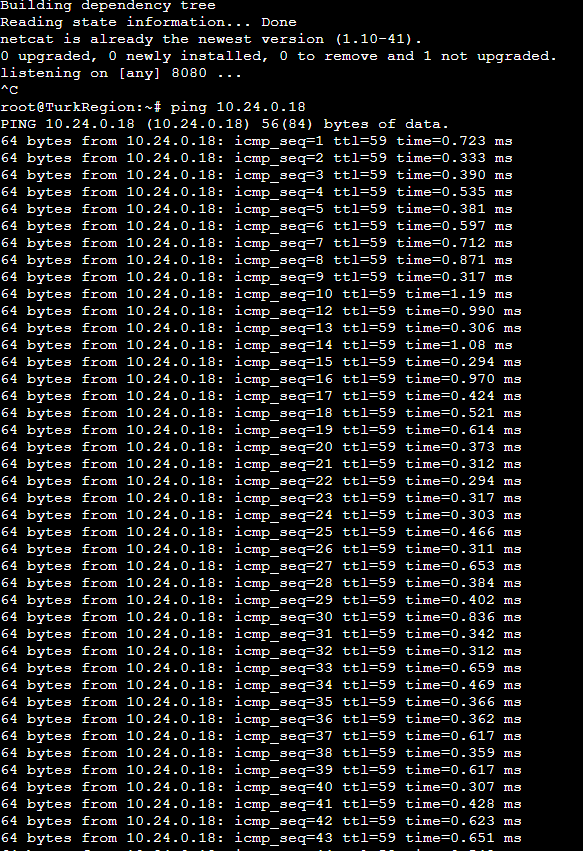

GrobeForrest (Gagal Koneksi)


#### Ping Revolte
LaubHills


SchewerMountains
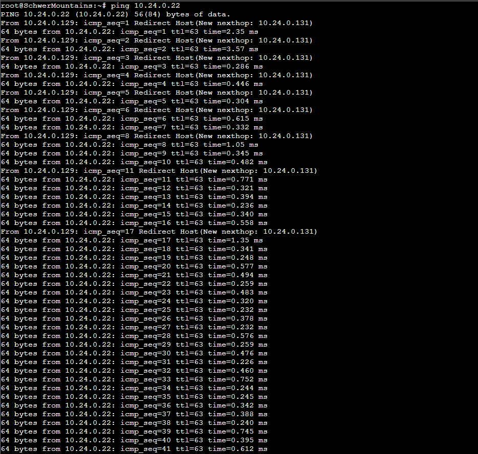

TurkRegion


GrobeForrest


### 4. Lakukan pembatasan sehingga koneksi SSH pada Web Server hanya dapat dilakukan oleh masyarakat yang berada pada GrobeForest.

Lakukan setting pada `Sein` dengan command 
```bash
iptables -A INPUT -p tcp --dport 22 -s 10.24.4.0/22 -j ACCEPT
```
Jangan lupa melakukan command 
```bash
iptables -F
apt-get update
bash .bashrc
```

Lakukan setting pada `GrobeForrest` dengan command
```bash
nmap -p 22 10.24.4.2
```
hingga muncul seperti ini 
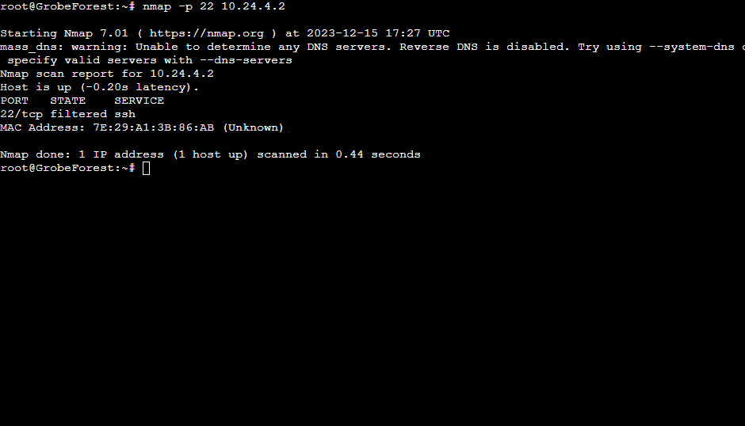

Lakukan command pada `Sein` dengan command
```bash
nc -lvp 22
```

Untuk cek hasil, lakukan command pada `Aura` dengan command 
```bash
nmap -p 22 10.24.4.2
```
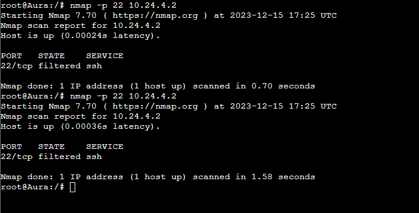


### 5. Selain itu, akses menuju WebServer hanya diperbolehkan saat jam kerja yaitu Senin-Jumat pada pukul 08.00-16.00.


### 6. Lalu, karena ternyata terdapat beberapa waktu di mana network administrator dari WebServer tidak bisa stand by, sehingga perlu ditambahkan rule bahwa akses pada hari Senin - Kamis pada jam 12.00 - 13.00 dilarang (istirahat maksi cuy) dan akses di hari Jumat pada jam 11.00 - 13.00 juga dilarang (maklum, Jumatan rek).


7. Karena terdapat 2 WebServer, kalian diminta agar setiap client yang mengakses Sein dengan Port 80 akan didistribusikan secara bergantian pada Sein dan Stark secara berurutan dan request dari client yang mengakses Stark dengan port 443 akan didistribusikan secara bergantian pada Sein dan Stark secara berurutan.


8. Karena berbeda koalisi politik, maka subnet dengan masyarakat yang berada pada Revolte dilarang keras mengakses WebServer hingga masa pencoblosan pemilu kepala suku 2024 berakhir. Masa pemilu (hingga pemungutan dan penghitungan suara selesai) kepala suku bersamaan dengan masa pemilu Presiden dan Wakil Presiden Indonesia 2024.


9. Sadar akan adanya potensial saling serang antar kubu politik, maka WebServer harus dapat secara otomatis memblokir  alamat IP yang melakukan scanning port dalam jumlah banyak (maksimal 20 scan port) di dalam selang waktu 10 menit. 
(clue: test dengan nmap)


10. Karena kepala suku ingin tau paket apa saja yang di-drop, maka di setiap node server dan router ditambahkan logging paket yang di-drop dengan standard syslog level. 


## Kendala
